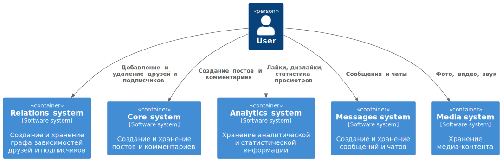
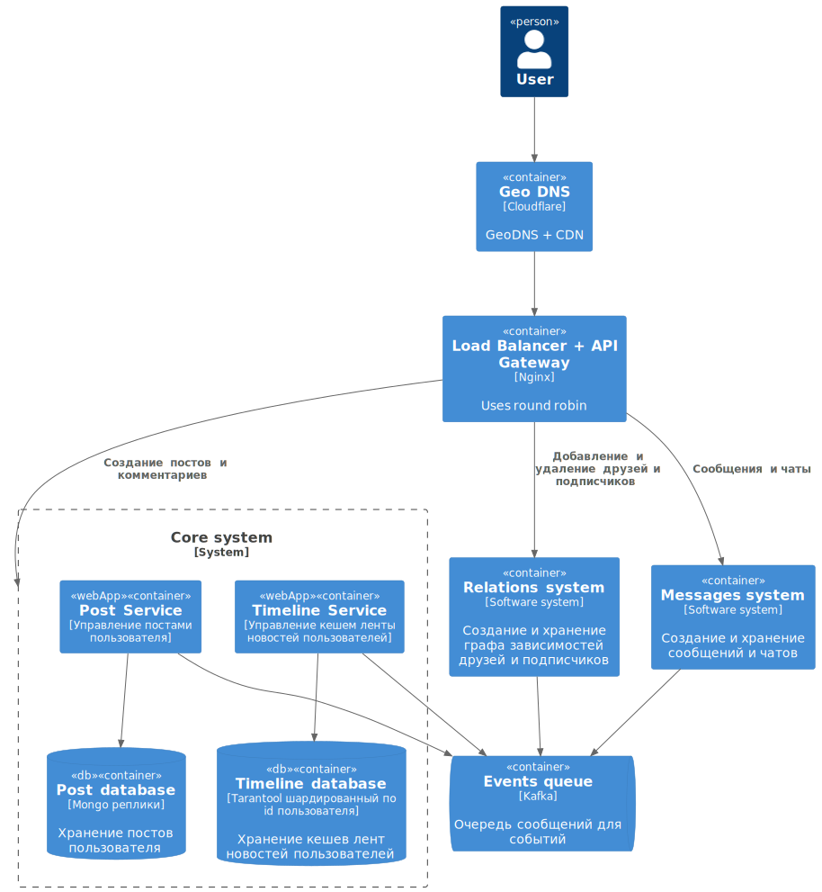
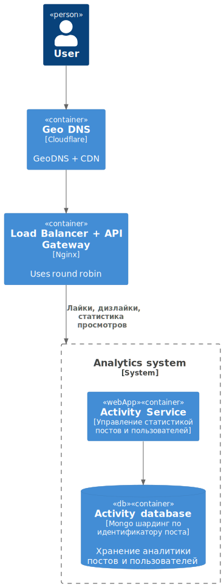
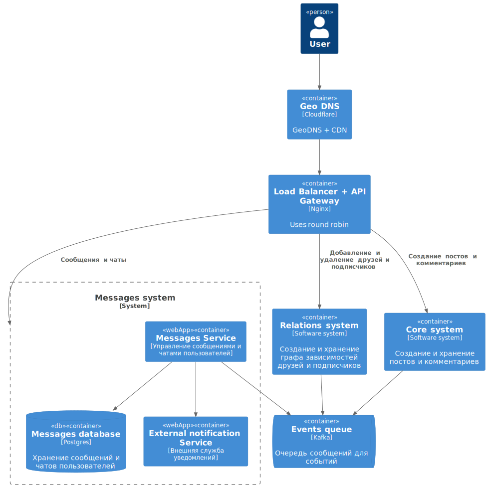
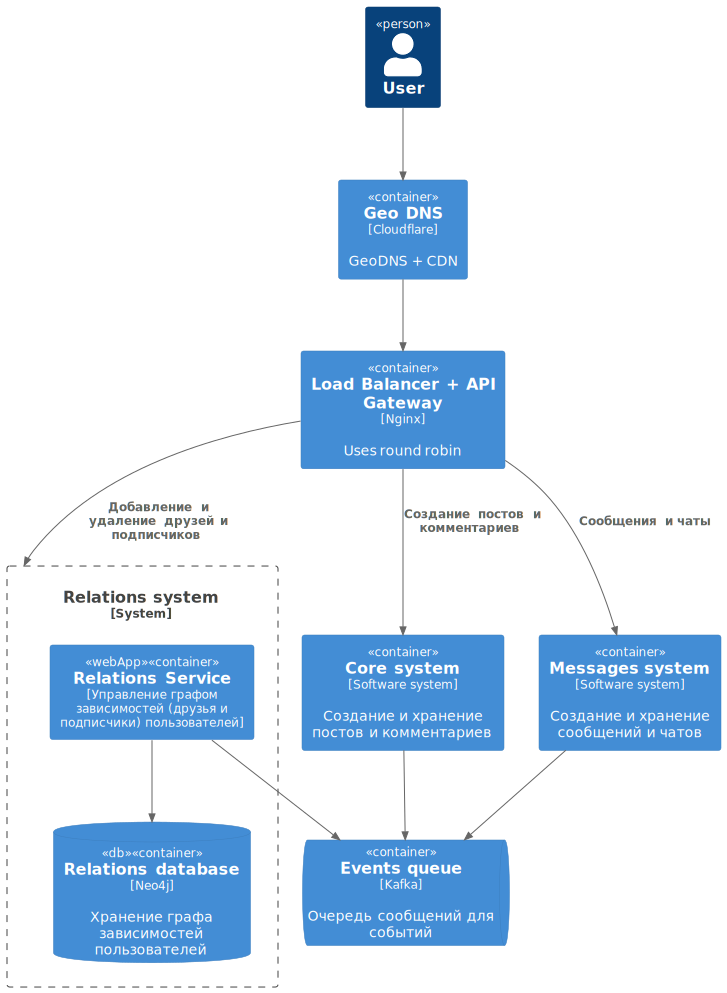
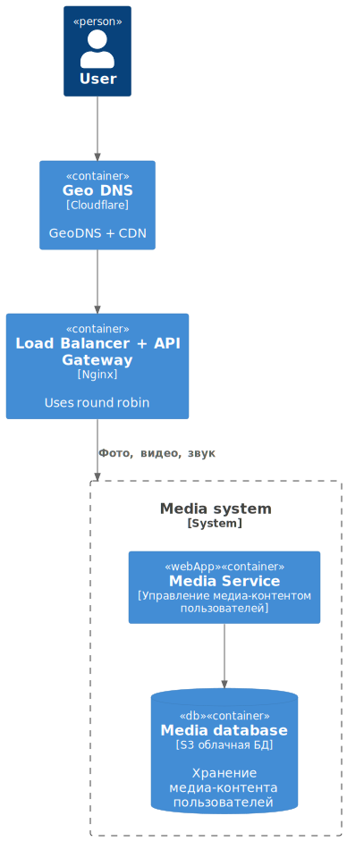

# System Design социальной сети для курса по [System Design](https://balun.courses/courses/system_design) !

### Functional requirements:

- добавление / удаление друзей
- просмотр друзей пользователя
- просмотр анкеты пользователя
- публикация постов с медиа-контентом в ленту
- загрузка медиафайлов для постов
- просмотр ленты постов (домашней и пользователей)
- просмотр диалогов и чатов пользователя
- отправка и чтение сообщений в диалогах и чатах
- читать, комментировать, лайкать посты других авторов
- делиться контентом из других соц сетей и видео-сервисов
- подписываться на интересных авторов
- получать уведомления от соц.сети о событиях интересных авторов

### Non-functional requirements:

- 45 000 000 DAU
- availability 99,95%
- посты храним всегда
- комментарии не ограничиваем
- одно изображение в посте
- max. время хранения сообщений 5 лет
- max. размер сообщения 2000 символов
- max. размер поста 10000 символов
- у пользователя в среднем 20 друзей
- пользователи пишут в среднем 1/3 поста в день
- пользователи пишут в среднем 3 сообщения в день
- пользователи заходят в среднем 5 раз в день в соцсеть
- гео респределение контента
- нет сезонности

## Design overview

Для дизайна системы использовалась [C4 model](https://c4model.com/)

     <b>Level 1.</b> System context diagram  

  

     <b>Level 2.</b> Core system container diagram  

 

  

     <b>Level 2.</b> Analytics system container diagram  

 

  

     <b>Level 2.</b> Messages system container diagram  

 

  

     <b>Level 2.</b> Relations system container diagram  

 

  

     <b>Level 2.</b> Media system container diagram  

 

  

## Basic calculations

- размер базы данных для хранения сообщений на 5 лет = 45e6 * 2e3 * 2 bytes * 3 * 365 * 5 ~= 986 TB
- рассчитать входящий трафик на создание постов = 45e6 * 0.33 * 10e3 * 2 bytes / 86400 ~= 3.5 MB / sec
- рассчитать входящий трафик на создание сообщений = 45e6 * 3 * 2e3 * 2 bytes / 86400 ~= 6.3 MB / sec
- количество шардов для базы данных сообщений = 986 TB / 100 TB (max HDD capacity) ~= 10 shards
- RPS по созданию постов = 45e6 * 0.33 / 86400 ~= 172
- RPS по чтению постов = 45e6 * 5 / 86400 ~= 2605
